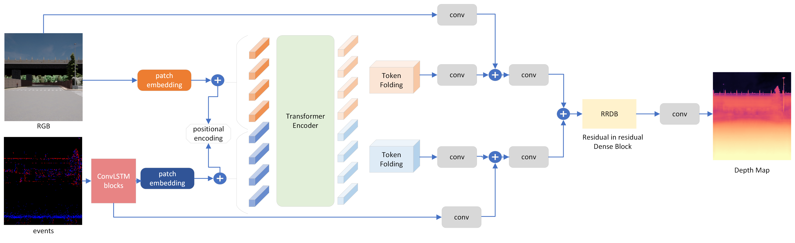

# [Multi-Modal Fusion of Event and RGB for Monocular Depth Estimation Using Transformer Architecture (ER-F2D)](https://openaccess.thecvf.com/content/CVPR2024W/MULA/papers/Devulapally_Multi-Modal_Fusion_of_Event_and_RGB_for_Monocular_Depth_Estimation_CVPRW_2024_paper.pdf)
<p>

</p>
This repository is the Pytorch implementation of our work - Multi-Modal Fusion of Event and RGB for Monocular Depth Estimation Using Transformer.


## Installation and Dependencies

To install and run this project, you need the following Python packages:

- PyTorch == 2.0.1
- scikit-learn == 1.3.0
- scikit-image == 0.21.0
- opencv == 4.8.0
- Matplotlib == 3.7.2
- kornia == 0.7.0
- tensorboard == 2.13.0
- torchvision == 0.15.2

You can install these packages using the following command:

```bash
pip install -r requirements.txt
```
## Datasets 
Download the datasets through the links provided below:

[EventScape](https://github.com/uzh-rpg/rpg_ramnet#eventscape)

[MVSEC](https://daniilidis-group.github.io/mvsec/download/)

## Pre-trained Weights
Download the pre-trained weights of the datasets provided below:

[EventScape](https://github.com/anusha-devulapally/ER-F2D/releases/download/v.01/eventscape_model_best.pth.tar)

[MVSEC](https://github.com/anusha-devulapally/ER-F2D/releases/download/v.01/model_best.pth.tar)
## Training
Download the pre-trained weights of vit-base [here](https://github.com/anusha-devulapally/ER-F2D/releases/download/v.01/pretrained_weights_updated_from_vitbase.pth).
```bash
CUDA_VISIBLE_DEVICES=0 python3 main.py --epochs 70 --batch_size 16
```
## Testing
Testing is done in two steps. First, is to run test.py script, which saves the prediction outputs in a folder. 
Download the pre-trained weights of the transformer-based models on the datasets and run the below command.
```bash
CUDA_VISIBLE_DEVICES=0 python test.py --path_to_model experiments/exp_1/checkpoints/model_best.pth.tar --output_folder experiments/exp_1/test/ --data_folder test 
```
Later, we run evaluation.py script takes both the groundtruth and prediction output as inputs, and calculates the metric depth on logarithmic depth maps using both clip distance and reg_factor. 
```bash
python evaluation.py --target_dataset experiments/exp_1/test/ground_truth/npy/gt/ --predictions_dataset experiments/exp_1/test/npy/depth/ --clip_distance 80 --reg_factor 3.70378
```

